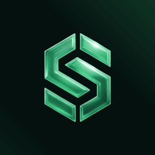

<div align="center">



# Stealthpad

### Launch a coin. Holders get paid in Zcash. Nobody holds the keys.

A launchpad on Robinhood Chain where every coin's creator tax fills its own vault contract, and the vault has no keys. Not ours, not the dev's. Holders claim their share as USDG, Zcash or dollars on Aleo.

[](https://stealthpad.online)
[](https://github.com/stealthpadRH/foundry)
[](https://github.com/stealthpadRH/foundry)
[](https://app.stealthpad.online)

[Website](https://stealthpad.online) · [Docs](https://stealthpad.online/docs) · [App](https://app.stealthpad.online) · [X @stealthpadRH](https://x.com/stealthpadRH) (reserved, soon) · [GitHub stealthpadRH](https://github.com/stealthpadRH)

</div>

---

## What is Stealthpad

Creator fees are the largest cash flow a new coin produces, and on most launchpads they land in one wallet. Fee-sharing pads changed who gets paid without changing who holds the money: a keeper wallet holds every vault key, so when it stalls payouts stop, and when it is compromised every vault drains at once. Stealthpad removes the keeper. Each coin's fees go into a StealthVault, a contract with no owner, no withdraw path, no upgrade and no pause, and anyone can run the round that shares them out.

- **Keyless vault per coin.** It can only pay valid claims, the round tip, and two protocol addresses fixed at deployment.
- **Permissionless rounds.** Any wallet runs a ready round and takes 3% of it in the same transaction. Nothing waits for us.
- **A snapshot that rewards holding.** Weight is the average balance across 12 random past blocks, seeded by the round's own block hash.
- **No launcher cut.** Launchers are paid only as holders of their own coin, under the same rule as everyone.
- **Payout where you want it.** USDG in the same wallet, Zcash to your own wallet, or USDCx and USAD on Aleo, delivered by NEAR Intents solvers.
- **Privacy stated plainly.** Zcash lands at your transparent address and becomes private when you shield it. Claims are public on Robinhood Chain. It is not a mixer.

## Core Mechanics

| Mechanic | Rule | Enforced by |
|---|---|---|
| Creator tax | 1, 2, 3, 4 or 5% of every buy and sell, fixed forever | StealthFactory, Pons V2 |
| Vault inflow | Creator tax plus the creator's share (70% today) of Pons V2's 1% trading fee | Pons fee escrow |
| Round ready | Vault plus escrow at least 0.02 ETH, and 1 hour since the last round | `MIN_ROUND`, `COOLDOWN` |
| Split | 92% holders · 3% caller · 2.5% $STEALTH vault · 2.5% treasury | Vault constants, no setter |
| Swap guard | Min-out 150 bps below the 30-minute TWAP; at most 1% of pool USDG per round | `SLIPPAGE_BPS`, `IMPACT_CAP_BPS` |
| Snapshot | 12 blocks from the window since the last round; average balance; floor 100,000 tokens | Attester, public verifier |
| Root | EIP-712 signed cumulative Merkle root, claimable after 2 hours; guardian may veto only | `ROOT_DELAY` |
| Claim | `claim(cumulative, proof, to, feeBps)`, one claim for every round, nothing expires | Vault |
| Route fee | Up to 0.20% on Zcash and Aleo claims, 0 on USDG, lower by $STEALTH tier | `MAX_ROUTE_FEE_BPS` |

## Core Loop

```
   ┌──────────────┐   buy / sell    ┌──────────────────────┐
   │   Traders    │ ──────────────► │ Pons V2 curve / pool │
   └──────────────┘                 └──────────┬───────────┘
                                               │ creator tax + creator fee share (ETH)
                                               ▼
                                  ┌──────────────────────────┐
                                  │  StealthVault (per coin) │  no owner · no withdraw
                                  │                          │  no upgrade · no pause
                                  └────────────┬─────────────┘
         ≥ 0.02 ETH and 1 h cooldown           │  runRound()  ◄──── any wallet (keeper)
                                               ▼
        ┌─────────────┬──────────────┬─────────┴────┬───────────────────────────┐
        ▼             ▼              ▼              ▼                           │
   3% caller    2.5% $STEALTH   2.5% treasury   92% holders ── swap ETH → USDG ─┘
    (tip, ETH)      vault                                   │
                                                            ▼
                      Attester: seed = round block hash, 12 random past blocks,
                      average balance, cumulative Merkle root, EIP-712 signature
                                                            │  2 h delay · guardian veto
                                                            ▼
                               claim(cumulative, proof, to, feeBps)
                    ┌───────────────────────┼──────────────────────────┐
                    ▼                       ▼                          ▼
             USDG, same wallet      ZEC to t-address,          USDCx / USAD
                                    holder shields it            on Aleo
```

## Repository Layout

```
stealthpadRH/
├── foundry   Solidity contracts: factory, per-coin vault, deployer
├── warden    Off-chain services: indexer, attester, keeper, verifier
├── console   The app at app.stealthpad.online
├── conduit   Read API reference and the TypeScript SDK
└── dossier   Thesis, threat model, privacy scope
```

| Repository | Role | Contents |
|---|---|---|
| [foundry](https://github.com/stealthpadRH/foundry) | Contracts | StealthFactory, StealthVault and VaultDeployer in Solidity 0.8.28 with Foundry. 23 unit tests, 4 fork tests against live Pons V2, protocol spec, CI |
| [warden](https://github.com/stealthpadRH/warden) | Off-chain services | Indexer, attester, keeper and public verifier in TypeScript with viem and Postgres. 17 arithmetic checks, runbook |
| [console](https://github.com/stealthpadRH/console) | App | Next.js 16 app: board, launch, coin, claim, keeper, receipts, plus the public read API. Non-root Docker image |
| [conduit](https://github.com/stealthpadRH/conduit) | API and SDK | Read API reference, `@stealthpad/sdk`: API client, `claim()` builder, NEAR Intents route quotes, Zcash and Aleo address validators |
| [dossier](https://github.com/stealthpadRH/dossier) | Documentation | Thesis with the snapshot math, STRIDE threat model, privacy scope |

## Tech Stack

| Layer | Technology |
|---|---|
| Chain | Robinhood Chain (Arbitrum Orbit L2, chain id 4663, ETH gas) |
| Contracts | Solidity 0.8.28, Foundry, forge-std |
| StealthFactory | `0xFd97db83afa0808d10E225efFE34D54b360d68CC` |
| Launch venue | Pons V2 LaunchFactory `0x7eD598BcEf8bd9Edd8C97A195C6d13f40801EC7e` |
| Payout asset | USDG `0x5fc5360d0400a0fd4f2af552add042d716f1d168`, swapped on the WETH/USDG pool |
| Off-chain | TypeScript, viem, `@openzeppelin/merkle-tree`, managed Postgres |
| App | Next.js 16.3.7, React 19.2.8, viem 2.56.9, Tailwind 4, standalone output, non-root containers |
| Payout routes | NEAR Intents 1Click and solvers (Zcash, Aleo) |

## Roadmap

| Phase | Window | Scope |
|---|---|---|
| 0 | Done | Concept locked, payout routes measured, name and brand |
| 1 | Weeks 1 to 4 (now) | Contracts, fork rehearsal against live Pons V2, indexer, attester and verifier, the app, landing page and docs, external audit, mainnet day with $STEALTH first |
| 2 | Months 1 to 2 | Guardian to multisig, backup attester set, Adopt mode for existing Pons coins, shielded Zcash delivery when the route supports it, automated receipts, keeper leaderboard, analytics |
| 3 | Months 2 to 4 | Claim relayer (no ETH needed), native Uniswap mode if asked for, Monero when NEAR Intents lists it, claim widget |
| 4 | Months 6 to 12 | Vaults on other EVM chains, SDK for launchpads, partner routes |

Proven end to end on a fork of Robinhood Chain: connect, buy, sell, launch with logo, run a round with the tip paid, claim USDG, live Zcash quote. The StealthFactory is live on mainnet and launches are open. Not yet: audit, $STEALTH launch.

## Token at a Glance

| | |
|---|---|
| Ticker | $STEALTH |
| Supply | 1,000,000,000, fixed, no mint |
| Distribution | 100% on the Pons V2 bonding curve |
| Team allocation | None |
| Presale | None |
| Launch | First coin on mainnet day, through the StealthFactory |
| Creator tax | 3%, into its own StealthVault; $STEALTH rounds split 94.5% holders, 3% caller, 2.5% treasury |
| Utility | 2.5% of every round on every coin flows to the $STEALTH vault; route fee relief; early access to new routes; Core tier signal vote |
| Contract address | **None yet.** Published on launch day through official channels only |

| Tier | Share of supply | Route fee | Extra |
|---|---|---|---|
| Visitor | any | 0.20% | |
| Holder | at least 0.05% | 0.10% | holder badge |
| Keeper-plus | at least 0.2% | 0% | early access to new routes |
| Core | at least 1% | 0% | signal vote on the next route |

$STEALTH never buys a larger share of any coin's rounds, a better snapshot, or priority.

## Reference Links

| Resource | Link |
|---|---|
| Website | https://stealthpad.online |
| Docs | https://stealthpad.online/docs |
| App | https://app.stealthpad.online |
| Thesis | [dossier/THESIS.md](https://github.com/stealthpadRH/dossier/blob/main/THESIS.md) |
| Threat model | [dossier/THREAT_MODEL.md](https://github.com/stealthpadRH/dossier/blob/main/THREAT_MODEL.md) |
| Privacy scope | [dossier/PRIVACY_SCOPE.md](https://github.com/stealthpadRH/dossier/blob/main/PRIVACY_SCOPE.md) |
| API reference | [conduit/ENDPOINTS.md](https://github.com/stealthpadRH/conduit/blob/main/ENDPOINTS.md) |
| Protocol spec | [foundry/PROTOCOL_SPEC.md](https://github.com/stealthpadRH/foundry/blob/main/PROTOCOL_SPEC.md) |
| Operations runbook | [warden/RUNBOOK.md](https://github.com/stealthpadRH/warden/blob/main/RUNBOOK.md) |
| StealthFactory | [0xFd97...68CC](https://robin.etherscan.io/address/0xFd97db83afa0808d10E225efFE34D54b360d68CC) |
| Explorer | https://robin.etherscan.io |
| X | [@stealthpadRH](https://x.com/stealthpadRH) (reserved, soon) |
| GitHub | [github.com/stealthpadRH](https://github.com/stealthpadRH) |

## Scam Warning

> **There is no $STEALTH contract address yet.** Any address posted before launch day is fake.

- The contract address is published **on launch day, through official channels only**: stealthpad.online, app.stealthpad.online, and @stealthpadRH on X.
- **There is no presale, no private round, no whitelist.** 100% of supply goes on the Pons V2 curve.
- **The team never sends the first direct message.** Anyone who messages you first offering tokens, support or early access is a scammer.
- **A claim never needs a token approval, an off-chain signature, or your seed phrase.** It is one transaction to the coin's vault, on app.stealthpad.online/claim.
- Confirm any coin is genuine with `StealthFactory.vaultOf(token)`: a coin the factory did not launch has no vault.
- There is no Telegram group. Anything claiming to be one is not Stealthpad.

## Quick Start

```bash
# contracts: build and run the unit tests
git clone https://github.com/stealthpadRH/foundry.git
cd foundry
forge install foundry-rs/forge-std@v1.16.2 --no-git
forge build
forge test

# app: run the console locally
cd ..
git clone https://github.com/stealthpadRH/console.git
cd console
npm install
npm run dev                       # http://localhost:3000
```

The indexer that fills the app's database is in [warden](https://github.com/stealthpadRH/warden).

---

<div align="center">
<sub>Stealthpad is experimental software on public blockchains. $STEALTH and every coin launched through Stealthpad are digital tokens with no promise of value, profit or return. Payouts depend on trading volume, which can fall to zero. Smart contracts can contain bugs despite audits and tests. Nothing here is investment, legal or tax advice. Only use funds you can afford to lose. Stealthpad is independent and is not affiliated with Robinhood, Pons, NEAR, or the Zcash and Aleo foundations.</sub>
</div>
